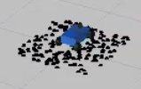
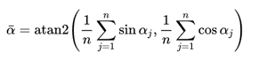
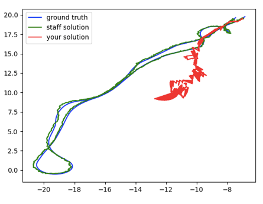
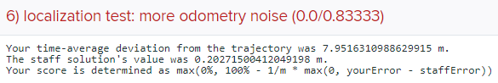
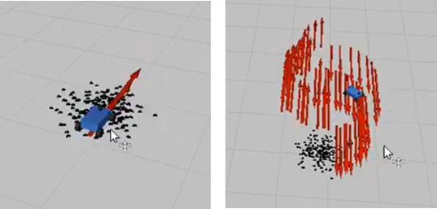

# Lab 5 Report:
Authors: Ethan Garza, Wilson Guo, Suzanna Jiwani, Charles Magaw, Christian Schillinger

Editor: Christian Schillinger

## Table of Contents

<ol>
<li>Introduction 
1.1. Goals and Motivation (Charles Magaw) 
1.2. Motivation (Suzanna Jiwani)</li>
<li>Technical Approach 
2.1. Motion Model (Suzanna Jiwani) 
2.2. Sensor Model (Wilson Guo) 
2.3. Particle Filter (Christian Schillinger)</li>
<li>Experimental Evaluation 
3.1. Motion Model (Ethan Garza) 
3.2 Sensor Model (Wilson Guo) 
3.3. Particle Filter (Christian Schillinger)</li>
<li>Conclusion (Charlie Magaw)</li>
<li>Lessons Learned 
5.1. Ethan Garza 
5.2. Wilson Guo 
5.3. Suzanna Jiwani 
5.4. Charles Magaw 
5.5. Christian Schillinger</li>
</ol>

## Introduction: 
### Goals 
*Written by Charles Magaw*

In Lab 5, we implemented localization in simulation. Localization is a critical problem in the field of robotics that is more challenging than it seems. Localization is defined as determining a robot’s position in a known environment. In this lab we will use the Monte Carlo Localization approach. Monte Carlo Localization uses a combination of laser scans, a map, and odometry to pinpoint the location of the robot in a known map.

An example of a real world problem where localization is used is the kidnapped robot problem. In this problem there is no initial guess to where the robot is in the map. So the entire map must be covered in particles which are potential poses for the robot. Our problem is a scaled down version of this. We will give an initial “guess” of the robot’s location. Particles will be spread around this guess to find the actual pose of the robot. The localization will continue as the robot moves and the particles begin to converge to the actual location of the robot in the map.

### Motivation
*Written by Suzanna Jiwani*

Localization is important for our robot because it needs to be able to determine its own position in order to make informed decisions about what to do next. In the context of the final challenge, where we would race around the Stata basement, we know the map (ie. the racecourse), but the robot will need to know where it is on the map in order to process higher-level decision making, like navigation. In order to do so, we can use information from the on-board LiDAR, the known map, and odometry in our localization algorithm to get an accurate sense of where the robot is. 

## Technical Approach: 
### Motion Model
*Written by Suzanna Jiwani*

A pose is a description of a position and orientation in space. A Pose message, of the geometry_msgs class in ROS, does so using typical (x,y,z) coordinates as well as a set of quaternion (qx,qy,qz,qw) coordinates, but we generally limited our description to a simple set of (x,y,theta) coordinates since we knew that we would only be moving in 2D. 
The primary function of the motion model is to ‘move’ a particle or array of particles by returning its new pose(s) given an odometry measurement. It does so by first rotating the odometry measurement into the same coordinate frame as the map. This is a necessary step because the odometry measurement is given in the frame of reference of the robot, while the pose is in the global ("map") frame of reference. Thus, before you can add the odometry vector to the old pose vector, you need to rotate it by the same theta as in the old pose. This yields the new pose of a single particle. Algorithmically, this means that for every pose in the array of particle poses, we must add the rotated odometry measurement to the pose and then return the new pose. For an array of poses, this would mean returning an array of updated poses. 
An additional consideration for this model is whether or not we want to add noise. We add noise if the model is not deterministic, and we do so based on standard deviation and randomness intensity, found at the top of our code. In order to add noise, we simply alter the odometry measurement by a random amount related to the standard deviation and randomness intensity.

### Sensor Model
*Written by Wilson Guo*

The sensor model incorporates measurements from LiDAR to hone in on an estimated state. On a macro level, the sensor model assigns likelihood weights to each particle which helps to increase the likelihood of the correct hypothesis while decreasing the likelihood of a wrong hypothesis. 
Intuitively, the sensor model "chooses" the particles generated by the motion model. Particle hypotheses generated by the motion model serve as arguments to our sensor model. The model subsequently calculates the probability of such particles, conditional on the sensor readings. We then employ the numpy.random.choice function to re-sample our particles based on those probabilities. 
The sensor algorithm:
We are given four probability distributions to work with: phit, pshort, pmax, and prand. The probability distributions correspond to measurement noise, an unexpected object detection, detection failures, and random noises respectively. 
1. We first assume that the sensor computed the correct range, with partial measurement noise. In this case, the noise is modeled by a Gaussian distribution with mean zt and standard deviation σhit. We are effectively calculating phit(zt | xt,m) = N(zt, σhit) 
2. The next conditional probability accounts for unexpected objects not in the given map. While the map represents our pre-loaded, static understanding of the environment, objects are normally dynamic; unexpected objects certainly arise in the sensor readings. In modeling these unexpected objects, we treat them as sensor noise. We are less likely to sense these objects as the range increases, and we thus can derive the following probability equation: pshort ( zt | xt , m ) = 2 / zt ( 1 − zt / zt )  

3. We also sometimes miss objects altogether, and the sensor reading returns the maximum sensor amount. This case is modeled by an indicator variable at prand = 1 if an event happens and prand= 0if it doesn’t.

4. Finally, our sensor also often produces random, unexplained measurements. This is modeled using a uniform distribution across the range of measurements: prand = 1 / zmax if 0 ≤ z < zmax .

### Particle Filter 
*Written by Christian Schillinger*

The particle filter class contains the main organizational structure of the Monte Carlo Localization algorithm. It ties together and “manages” instances of the motion model and sensor model classes. The following set of bullets summarize the high level structure of the particle filter:
1. Instantiate a set of particles as poses in a normal distribution around a starting input pose.
2. When odometry data is received,  use the motion model to update the particle positions
3. Determine the “average” particle, and publish that as the robot pose.
4. Whenever sensor data is received, use the sensor model to compute the likelihood each particle has accurately determined its position. 
5. Resample the particles based on these probabilities, and determine the “average” particle and publish it as the robot pose.
6. Repeat from Step 2

This process works by making a set of educated but hedged guesses. Unlikely guesses are pruned while likely particles are used to create the next set of educated guesses, which essentially creates a cloud of poses centred around the true pose of the car. The ability to prune unlikely particles makes the process robust to many potential sources of error. For instance, if the odometry data is glitchy at a particular time step, it is likely that there are still particles near the correct position to act as a basis for resampling using LiDAR data.

Points of interest in our version of particle filter:
- We wrote a function to visualize the particles around the car as markers of the type SPHERE_LIST. This was used to debug the noise introduction:

 

**Figure 1**: This picture illustrates the spread of the starting particles as a random distribution
- Starting particles poses were created by using numpy.random.random in conjunction with the input pose. 
- Our average pose function found the weighted mean angle of the resampled poses using the following equation for means of circular quantities:

 

- Our odometry callback function (the function that executes Step 2 above) used velocity data from the Odometry_msg twist data in conjunction with time steps to input the odometry into  our motion model.
- Our LiDAR callback function (the function that executes Step 4 above) used thinned LiDAR data as an input to the sensor model and received probabilities for each particle as an output, which were in turn used for resampling (Step 5).

## Experimental Evaluation:
### Motion Model 
*Written by Ethan Garza*.

 

**Figure 2**: Each differently colored line represents a different path. The blue line represents the true trajectory of the car. The green line represents the staff’s solution estimating the path of the car traveled. The red line represents our team’s solution estimating the path of the car traveled.

According to the unit tests, the motion model had passed all expectations alone. Qualitatively and through visual inspection, our motion model had worked as expected. As for the autograder portion, we were unsure as to which part had failed. To help in its evaluation, we isolated each part (sensor model and motion model callback functions running separately). Visually, when the motion model were to run alone with noise, without probable resampling, the particles would disperse across the map. This was expected given the intuition explained in its derivation. When the motion model was run without noise, the particles would move along the same relative path of the car as expected due to similar reasoning.

### Sensor Model
*Written by Wilson Guo*

Although our sensor model was able to pass all of the provided unit tests, the method of summing together probabilities may have not been mathematically valid. As mentioned in the lab assignment file, the probability distribution of random noise, pnoise, is a probability density and not a probability mass function. Therefore, we cannot simply add them together. However, according to the lab document, the probabilities are supposed to be added together once we multiply by a provided constant which we did. We believe any error from the sensor model script may have come from this seemingly invalid summation. 

### Particle Filter 
*Written by Christian Schillinger*

Our particle filter did not perform perfectly. To test our code quantitatively, we used the Autograder to assess the deviation of the calculated trajectory from the provided trajectory. Some of the results are shown in the image below:

 

**Figure 3**: The image above shows that the time-average deviation from the proposed trajectory was larger than the staff solution value by over a factor of 40. This is due to problems in our average pose calculation, as the location of the set of particles remained relatively accurate despite the output pose.

In simulation, we made qualitative observations about the performance of our implementation of particle filter, shown below:

 

**Figure 4**: The image above shows how inaccurate the average pose calculation was, despite the accurate general location of the cloud of particles.

Overall, our particle filter did not perform quantitatively well, but we did see qualitatively promising simulations in the later stages of our code development. With more time, we are confident we could have improved the average pose calculation and in in turn, decrease our time average derivation from the input trajectory

## Conclusion:
*Written by Charles Magaw*

Localization proved to be difficult to implement. The first step towards implementing Monte Carlo Localization was to create a motion model and a sensor model as described within the report. We successfully implemented our motion and sensor models. Before moving to integrating these into a particle filter, we used unit tests to ensure our motion and sensor models were correct. We passed all four of these provided unit tests proving our implementation was correct.
Next we had to integrate our motion and sensor models to create a particle filter. However, we were unable to successfully implement a fully functional particle filter. The Monte Carlo Localization should converge to the true location of a moving or stationary robot in simulation. Our localization algorithm converges to a cluster showing the correct pose when the racecar is stationary. When the racecar is set in a circular motion the particles determined by the localization algorithm follow a similar path but do not exactly follow the car’s speed around the circle. The pose also does not appear correctly in our local simulation. 
This problem persisted when we submitted our code to gradescope. The trajectory can be seen in the section above. It is not following the ground truth trajectory resulting in a time-average deviation from the truth of 7.95 meters. The staff solution produced a time-average deviation of 0.20 meters. 
Our solution received partial credit from the gradescope autograder for subscribing and publishing to the correct topics and operating at an appropriate rate of 25.89 Hz. Achieving this code efficiency was done through the use of numpy arrays instead of python loops. Code was also cleverly optimized to reduce unnecessary function calls. Function calls and looping in python are incredibly slow and inefficient especially when within the critical code path that is executed continuously.

## Lessons Learned:
### CI Lessons Learned
#### Ethan Garza
During these times, it was very difficult to sort of come together and work together. It was also very difficult to be focused and organized. We also found difficulty in using resources such as Office Hours. We were able to attend many sessions, but found it hard to make use of them because of communication difficulties, etc. However, we eventually converged and made an amazing product. I am sad that it wasn’t fully complete, but was happy to have seen the results.

#### Wilson Guo 
Given the current situation, we quickly learned that it was difficult to hold regular group meets especially with group mates in different time zones. Moving forward, we will discuss meeting times that work for everyone and assign independent parts of the labs when we cannot meet to discuss lab approaches. 

#### Suzanna Jiwani
Pairing up for parts of the lab, though it may seem difficult because you need to plan time that works for both people, was really helpful because it held people accountable to their partners. It also helped when something was conceptually challenging to talk to another person about it. 
#### Charles Magaw
Communication becomes more important and more difficult when working remotely. It is more important because it is essential that everyone is kept up to date with the progress and work of others. As a team it is best when all members can participate which requires open communication. It is obviously more difficult because there is no way to meet face to face. Zoom eases this burden and the screen sharing function proved essential to our teamwork.
#### Christian Schillinger
At the start of the lab, I thought that working remotely would make preparation for the briefing/presentation portion of this lab easier, as I would have more time and unlimited attempts to perfect my contentions. However, I found that it is difficult to sound confident and feel persuasive while recording my sections. I look forward to honing my electronic presentation skills in upcoming labs.

### Technical Lessons Learned
#### Ethan Garza
In this lab, I spent a lot of time tinkering with matrix and cross multiplication in numpy, working to speed up the computation in our motion model. Learning the intricacies of how numpy functions work on two and three dimensional numpy arrays was a challenging yet enjoyable and enlightening process.
#### Wilson Guo 
Completing this lab strengthened my understanding of geometry and linear algebra. Additionally, I also learned how to work with empirical probabilistic data which is a key feature in Monte Carlo Localization. 
#### Suzanna Jiwani
I learned a lot about probability distributions, and by working so hands-on and in-depth on the functions, I more fully understand the ideas behind Monte Carlo localization and the issues with implementation.
#### Charles Magaw
Through this lab I realised the importance and difficulty in implementing localization. However, I now feel more comfortable with the concepts of Monte Carlo Localization. While the implementation was tough, I learned a lot about modeling, filtering and working in simulation.
#### Christian Schillinger
The most important technical skills I learned in this lab surrounded optimizing working code for efficiency, using techniques lime eliminating loops, using numpy, minimizing function calls, using slice indexing, and generally keeping critical code paths clean
